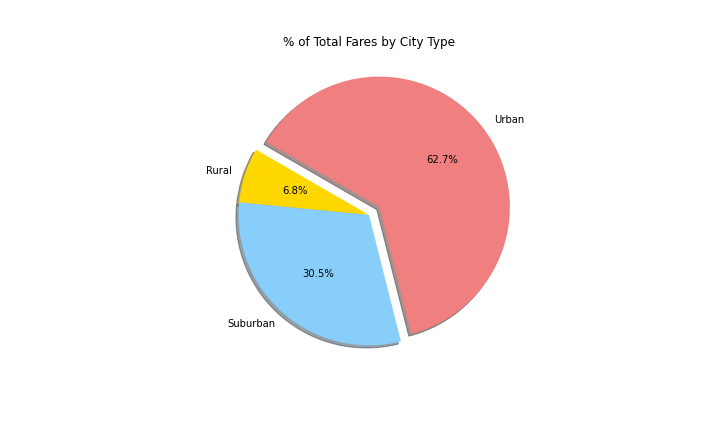
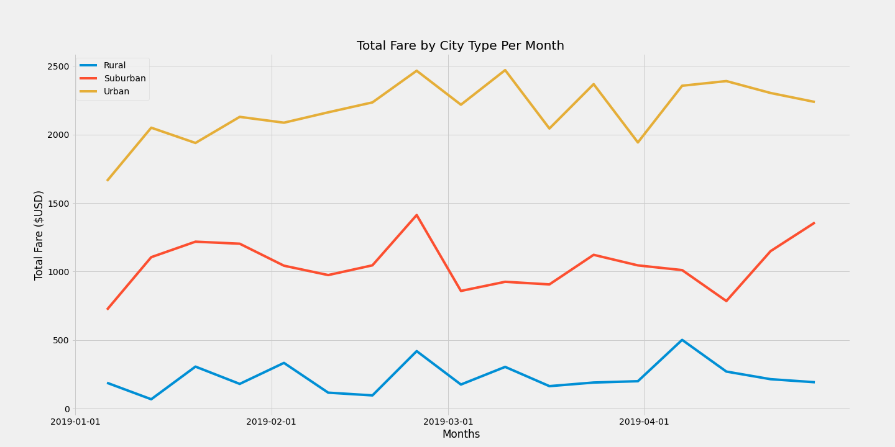

# Pyber_Analysis
## Overview of the analysis: 
PyBer is a ride sharing company that uses Python based app. The goal of this analysis is to provide insight on the data gathered in an excel sheet format using Python, Panda, Matplotlib. We will be using those tools to determine drivers in suburban cities, urban cities, and rural cities. The presentation to stakeholders should include.
1.	Total number of rides by city type using bubble chart 
2.	Ride count per passenger by city type by using box and whisker plot
3.	Numbers of pie charts for.
Percent of total Fares by City Type 
Percent of Total Rides by City Type
Percent of Total Drivers by City Type and 
4.	Line chart for Total Fare by City type per month 
We will explore results in the results section.
## Results: 
### Total number of rides by city type
Bubble chart is a type of scattered chart that helps provide not only data points also size of the data size. The x-axis shows the number of rides per city, y-axis is for the average fare for that city, the color of the bubble represents city type and size number of drivers in that city. 
From the chart, we can see Average fare is higher in rural cities and number of rides per city as well number of drivers is much higher in urban cities. 
From the chart, we can infer
1. There are a lot more business available in urban areas and also lot more drivers. 
2. However, average fare is much lower in urban cities than in rural and suburban cities. 
3. As urban cities have higher population density than suburban and rural cities, demand and supply for the ride is higher. However, those rides cover a shorter distance, therefore, average fare is lower.  
4. There are two cities that have a lot of drivers, but average fare is about $20 could use some further analysis to see if the average fare could be increased by adjusting price or reducing the number of drivers.   

### Ride count per passenger by city type
Box and whisker are a great way to represent statistics summary for a dataset. It shows the distribution of data as well as outliers if any. Below are the ride count data by city type. Here we compare the number of rides by passengers. Overall, urban passengers use rides more often than suburban and rural passengers. 

![Ride Count per Passenger by City Type] (analysis/Fig2.png)

### Percent of Fare, Rides, and Drivers by City Type 

Pie charts are quite useful when you look at parts of a whole picture. Using percentage to divide and presenting it useful. For example, if we look at rural data. We can see the rural fare percentage is 6.8% where the number of rides is 5.3% and the number of drivers is 2.8%. Therefore, while rural drivers make smaller percentage of the total they getting more rides per driver and more money per ride. 

### Total Fare by City type per month
Line chart is good at representing trend and comparing trends. Here in the chart, we can see there are three lines of trends in the last third of the march there was a spike in rides for all city types. Where everywhere else there is no clear trend. Assuming it is spring break time company should look at having more availability of drivers during that period to maximize profit. 

## Summary: 
Matplotlib, Pandas and Python are powerful tools to create charts that can tell stories in much better ways than just simply looking at data. From drawing different charts we have seen visualizing gives a better look at the story and helps with decision making. Matplotlib allows you to customize these graphs and many different ways so it could be presented in a customized way.
